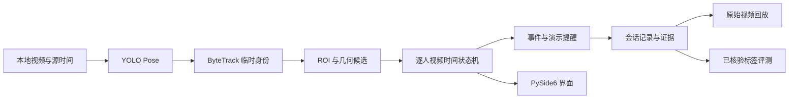

# 仓储作业姿态风险辅助提醒

固定机位、本地视频的逐人作业事件与姿态候选分析。基于 YOLO Pose + ByteTrack + 视频时间状态机，提供 ROI 设置、证据记录、原始视频回放和人工核验后评测。

**10 秒是可配置的演示提醒规则，不是医学、人体工效或安全合规阈值。** 手腕进入 ROI 只表示二维区域相交；弯腰候选可能受到朝向、遮挡、下蹲和透视影响。所有辅助提醒均需人工复核。

## 当前完成情况

- 独立 `warehouse-pose` 环境，CLI 与 PySide6 桌面共用一套分析核心。
- 每人、每货架独立记录事件；持续确认、角度滞回、缺点处理、10 秒单次提醒。
- ROI 黑边坐标修正、会话隔离、唯一证据名、视频到尾结束、异常恢复。
- 事件列表双击回放，不重新运行模型或增加计数。
- 已运行真实 GPU 示例、真实 Qt 工作线程、四组模型／规则预测对照。
- 已准备 30 段复核视频；第一批人工反馈已录入，04、05 共40秒开发负例无弯腰误报。完整正例指标仍待人物／区域核验。

详细实测与缺口见 [验收记录](docs/acceptance.md)。当前结果属于同场景开发／固定回归，尚未完成独立新场景验证。仓库中的历史 `assets/demo.gif` 仍是旧版界面，不能代表新版；新版演示与复核素材暂仅本地保存，未随本次源码公开；本机路径可通过未跟踪的 `output/delivery_locations.json` 查阅。

## 启动

本机已建立环境：

```powershell
conda activate warehouse-pose
cd Warehouse_Shelf_Posture_Recognition
python -m src.app
```

在其他机器创建新环境：

```powershell
# CUDA 12.8 版本；CPU 环境改为 -Device cpu
powershell -File scripts/setup_environment.ps1 -Device cu128
conda activate warehouse-pose
python scripts/download_assets.py --model --video
python -m src.app
```

安装脚本不会修改已有同名环境。`requirements.txt` 声明直接依赖，`requirements.lock.txt` 固定本次 Windows/Python 3.10/CUDA 环境的传递依赖。CPU 安装不套用 CUDA 专用锁文件。首次实现环境从 ai-x 隔离克隆，后续安装不修改 ai-x；干净机器完整安装仍是待外部复现项。

资源下载验证 SHA256，不覆盖已有不同内容文件。模型和示例不在 Git 中；示例视频历史 Release 的远端可用性没有在本轮完整验证，下载失败会明确报错，不伪装成功。当前本地资源已验证。

## 使用流程

1. 选择视频与模型，点击“预览 / 加载 ROI”。
2. 沿货架区域边界依次点击四点，或核对已加载区域；点击“确认当前 ROI”。也可以确认不使用 ROI，只分析姿态。选择有足够空间的“会话保存目录”。
3. 选择设备与演示提醒时长，开始分析。视频按处理能力分析，界面显示节流不改变视频时间计数。
4. 分别查看画面人数、作业事件、姿态候选、辅助提醒与无法判断人数。
5. 分析结束后双击事件，回放事件前后各两秒原始视频。加载历史会话时会检查源视频哈希。

每次输出在 `output/sessions/<session_id>/`：

- `manifest.json`：视频和模型哈希、配置、代码指纹、环境、硬件与会话状态。
- `events.jsonl` / `events.csv`：完成或截断的事件、视频时间、有效时长、提醒时刻及证据路径。
- `observations.jsonl`：逐帧轨迹框、角度、状态和可判断通道。
- `transitions.jsonl`：实时事件开始、提醒、结束日志。
- `images/`：唯一事件编号绑定的截图。
- `summary.json`：性能、事件数、无法判断覆盖率及 `pending_human_verified_labels` 状态。

## 无界面分析与评测

```powershell
python -m src.cli analyze --video data/video_1.mp4 --model models/yolo11n-pose.pt --config configs/default.json --roi data/roi_config.json --device cuda:0

# 三种规则模式：baseline / tracked / stable
python -m src.cli analyze --video data/video_1.mp4 --roi data/roi_config.json --mode baseline

# 只有人工确认的标签和人物对应表才能评分
python -m src.cli evaluate --session output/sessions/实际会话编号 --labels 已核验标签.json --output output/evaluation/新结果目录

python -m pytest -q
```

CLI 的显式 `--roi` 表示调用者已核对区域；GUI 首次加载旧区域必须人工确认。未传 ROI 时不分析伸手，不把缺少区域配置解释为“没有伸手事件”。

`baseline` 保留旧版右侧三点、140°、手腕区域命中和画面级边沿计数；运行缺陷已修复，所用依赖版本已变化。它没有人物身份和分区语义，不能混入逐人评测。`tracked` 增加人物身份、左右侧质量选择，仍使用即时触发；`stable` 再加入时序稳定与角度滞回。对照差异应按这些定义解释。

原始模式推理检测置信度固定为0.5；跟踪组使用配置中的0.1，给ByteTrack提供低置信候选。关键点有效门槛默认均为0.5。这一步同时改变了检测输入、人物身份和侧面选择，不能把计数变化全部归因于跟踪；YOLO11与YOLO26的stable组才使用同样的完整机制配置。

## 架构



Qt 只接收分析结果，不重写算法；回放路径只解码视频。旧 `src/core_inference.py` 保留为历史调试参考，新入口不调用它。旧入口 `python src/ui/main_window.py` 仍兼容。

## 本次工程升级与后续

当前定位是离线分析工程原型，尚非现场部署系统。本次改动与待验证项见 [更新记录](CHANGELOG.md)。GitHub Actions 使用生成的视频／骨架和测试后端运行工程测试，不下载现场素材、不代表真实识别效果。

重新准备同样采样规则的复核包时，显式提供至少1385秒、25fps的源视频；该脚本的固定采样规则仅适用于已核查的同场景素材：

```powershell
python scripts/prepare_review.py --source path/to/long_video.mp4 --short data/video_1.mp4 --output output/review_bundle_v1
```

不得覆盖已有冻结包或把新视频自动当作已核验标签；可用 `--inventory-video` 追加待去重视频。

## 人工复核与后续

本轮复核使用修正版 `review_bundle_v2`，一次最多核验五段。原始视频、模型初标和人工反馈保留在本地，不随此次源码公开；验证摘要见[验收记录](docs/acceptance.md)。v1快速定位曾引入片头灰屏，旧视频和反馈保留用于追溯，不再作为新一轮完整评测输入。修正保持原时间窗口与数据划分，绝不挑换有利片段。

逐片段人工反馈、人物描述与时间标注仅本地留存，不随此次源码公开。标签定义、人物对应和冻结规则见 [人工复核说明](docs/review_protocol.md)。历史训练成绩与当前事件指标分开，模型初标不可直接作为真值。

作品集讲解与失败边界见 [技术讲解](docs/portfolio_notes.md)；新素材要求见 [独立视频验证清单](docs/new_video_checklist.md)。

## 许可与素材

历史项目代码附 MIT 许可证；Ultralytics、模型与其他依赖有各自条款，MIT 不会替代第三方许可。对外发布前核对这些条款与视频人物／场地授权；本轮公开源码和方法说明，不上传新视频或发布发行版。官方说明：https://www.ultralytics.com/license
