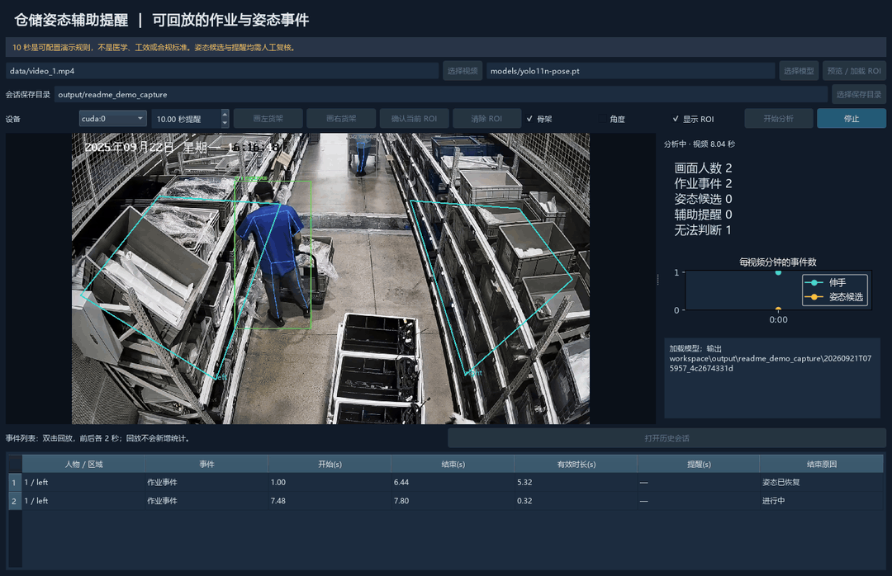
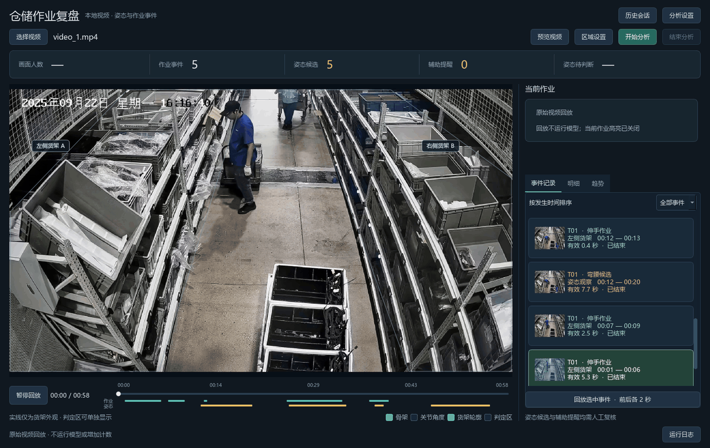
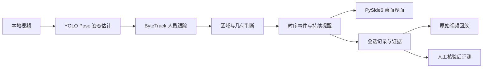

# 仓储作业姿态分析与辅助提醒

**把仓储录像中的作业动作，整理成可定位、可回放的事件。**

复盘货架拣选和补货过程时，仅靠观看整段录像，很难同时记录多名人员的动作、持续时间和发生位置。一个弯腰动作是否持续、一次伸手发生在哪个货架区域，都需要反复拖动进度条确认。

本项目面向固定机位仓储视频，结合人体姿态估计、人员跟踪和时序规则，逐人记录弯腰候选与伸手作业事件。使用者可以从事件列表直接回到对应片段，核对画面并导出记录，用于作业过程复盘和姿态分析研究。

`YOLO11 Pose` · `ByteTrack` · `PySide6` · `本地视频分析`

## 动态演示

### 逐人分析与事件记录

设置货架区域后，程序显示人员轨迹、骨架和姿态状态，并将动作整理为带起止时间的事件。



### 从事件回到原始画面

选择一条姿态事件，回放其发生前后各两秒的原始视频。回放与分析分开，不会重复触发提醒或增加计数。



以上动图取自新版程序对[已公开示例视频](https://github.com/Bkp-126/Warehouse_Shelf_Posture_Recognition/releases/tag/v0.1.0)的实际分析与回放。动图经采样加速播放；界面通过 Qt 离屏采集，不是实时性能演示。该样例没有触发持续 10 秒提醒。录制方式见[演示说明](docs/demo.md)。

<details>
<summary>查看旧版演示</summary>


旧版保留用于版本对照，其界面用语和计数方式与新版不同。

</details>

## 核心功能与本次升级

| 功能 | 使用方式与作用 |
|---|---|
| 逐人记录 | 为当前会话中的人员分配临时轨迹编号，分别记录动作；同一人双手进入同一区域合并为一次事件。 |
| 货架区域设置 | 在视频中框定关注区域，记录手腕进入区域的作业片段；区域随视频来源保存。 |
| 持续姿态提醒 | 按视频时间累计有效弯腰时长，达到设定时长后提醒一次；短暂关键点缺失不计入有效时长。 |
| 不确定状态处理 | 关键点不足或几何关系无效时显示“无法判断”；长时间缺失则结束事件并记录原因。 |
| 证据回放 | 通过事件列表定位原始视频，查看起止时间、持续时长、结束原因和关联截图。 |
| 记录导出 | 每次分析保存独立会话，输出 CSV、JSONL、截图、输入哈希、配置与性能统计。 |

这次升级将旧版的画面级计数改为逐人事件处理，并增加持续确认、角度滞回和缺失处理；桌面端与命令行共用分析核心。默认仍使用 YOLO11n-pose，旧规则作为对照模式保留。完整变更见[更新记录](CHANGELOG.md)。

## 快速启动

**环境：Windows、Conda、Python 3.10。** 可使用 CPU；NVIDIA GPU 环境可选择 CUDA 12.8 依赖。

在 Anaconda PowerShell Prompt 中执行：

```powershell
git clone --branch codex/portfolio-v1 https://github.com/Bkp-126/Warehouse_Shelf_Posture_Recognition.git
cd Warehouse_Shelf_Posture_Recognition

# 创建独立 CPU 环境；使用 NVIDIA GPU 时将 cpu 改为 cu128
powershell -File scripts/setup_environment.ps1 -Device cpu
conda activate warehouse-pose

python scripts/download_assets.py --model --video
python -m src.app
```

安装脚本创建名为 `warehouse-pose` 的环境；同名环境已存在时会停止，避免覆盖。CPU 使用直接依赖版本，CUDA 安装另外应用 Windows 依赖锁文件。模型与示例视频单独下载并校验 SHA256，也可在界面中选择自己的本地视频和模型。

**操作流程：**选择视频与模型 → 预览画面 → 绘制并确认货架区域 → 开始分析 → 双击事件回放。

只分析姿态时，可以确认不使用货架区域；此时不会分析伸手事件。更换视频或机位后，需要重新核对区域位置。

<details>
<summary>命令行分析、评测与输出文件</summary>

```powershell
# 不设置货架区域，仅分析姿态；CPU 可改为 cuda:0
python -m src.cli analyze --video data/video_1.mp4 --model models/yolo11n-pose.pt --device cpu

# 使用经核对的货架区域，同时分析伸手作业
python -m src.cli analyze --video data/video_1.mp4 --roi data/roi_config.json --device cpu

# labels.json 必须是人工核验完成、且绑定该会话的标签
python -m src.cli evaluate --session output/sessions/SESSION_ID --labels labels.json --output output/evaluation/result

python -m pytest -q
```

`data/roi_config.json` 仅对应示例视频，不能直接套用到其他场景。规则模式可通过 `--mode baseline|tracked|stable` 选择；默认参数见 [configs/default.json](configs/default.json)。

每个分析会话保存在 `output/sessions/<session_id>/`：

| 文件 | 内容 |
|---|---|
| `events.csv` / `events.jsonl` | 事件、人物轨迹、区域、视频时间、有效时长、提醒与结束原因 |
| `images/` | 关联事件编号的证据截图 |
| `manifest.json` | 输入与模型哈希、配置、代码版本、环境和会话状态 |
| `observations.jsonl` / `transitions.jsonl` | 逐帧观察与事件状态变化 |
| `summary.json` | 事件统计、无法判断覆盖率和分阶段耗时 |

</details>

## 架构



`src/pipeline.py` 负责解码与分析，`src/rules.py` 和 `src/events.py` 负责姿态判断与事件状态，`src/storage.py` 负责留存，`src/evaluation.py` 负责评测。GUI 与 CLI 调用同一套核心；回放只读取原始视频。

## 验证结果与局限

**工程验证：**22 项自动化测试覆盖逐人计数、持续时长边界、关键点缺失、事件结束、证据写入、区域坐标和评测约束。GitHub Windows CPU 环境的依赖安装、测试和代码检查已通过。完整示例的 GUI 工作线程与 CLI 事件记录一致，回放前后事件数不变。

**识别效果：**已运行原始规则、逐人规则、时序规则及 YOLO26 模型对照。现有素材属于同场景开发与固定回归；完整人工标签、真实长时间弯腰提醒正例和独立视频验证仍待补齐，因此暂不报告完整精确率与召回率。事件数量减少不能直接视为准确率提高。

- 默认 **10 秒**是可配置的演示提醒时长，不是医学、人体工效或安全合规阈值。系统提供辅助复核信息，不输出违规或健康风险等级。
- 二维姿态受机位、遮挡和透视影响，下蹲、转身可能与弯腰混淆；手腕进入区域也不等于完成取放操作。
- 当前支持本地视频离线分析。未接入摄像头或 RTSP，尚未完成独立场景和稳定实时性能验证。

[详细验收与失败案例](docs/acceptance.md) · [标注与评测方法](docs/review_protocol.md) · [独立视频验证清单](docs/new_video_checklist.md)

## 许可

项目代码使用 [MIT License](LICENSE)。Ultralytics、模型权重与其他依赖适用各自许可证，使用时需分别核对。用于其他场景的视频素材需取得相应授权。
